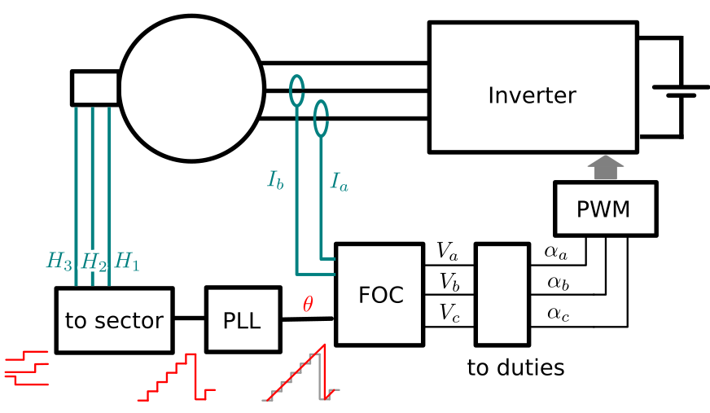
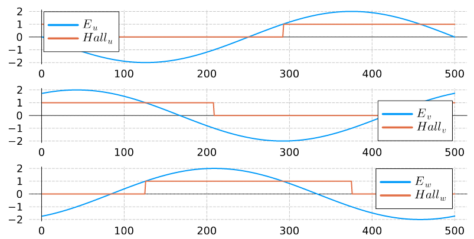
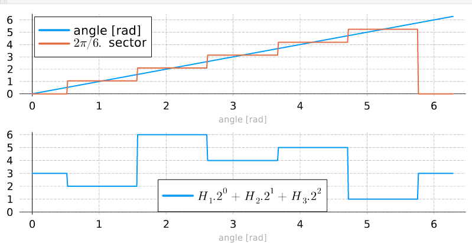

# Field Oriented Control with hall Sensors.


## Introduction.

This example show how to regulate the torque in a Permanent Magnet Synchonous Machine
(PMSM) using a Field Oriented Control (FOC) algorithm. 

The FOC is well adapted to PMSM with sinusoîdal back-emf (electro
motive forces). The FOC algorithm generate smooth torque value. 
The current regulators (Proportional-Integral) are in the _"dq"_ frame where values
should be constant during steady state operation.

To apply this technique we should have an acquisition of a continuous angle value [0, 2π[.
But for _"cost"_ reasons or integrations with other algorithms (BLDC), some motor have
only 3 discrete hall sensors value to indicate the rotor position.

In this case we use a PLL (Phased-Lock-Loop) filter to _"build"_ a contiuous equivalent
angle from the 3 discrete signals. 



## Import libraries to use it.

This example use some software components which are in the owntech `control_library`.
then you must import it by inserting the following line in the `platformio.ini` file.

```ini 
lib_deps=
 control_library = https://github.com/owntech-foundation/control_library.git
 scopemimicry = https://github.com/owntech-foundation/scopemimicry.git
```


## How the _"sector"_ table is built.

According _"dq"_ transformation, the formula of the back emf should be :

$E_{u} = - K_{fem}.\omega .sin(\theta)$

$E_{v} = - K_{fem}.\omega .sin(\theta - 2\pi/3)$

$E_{v} = - K_{fem}.\omega .sin(\theta - 4\pi/3)$

Where $\theta$ is the _"electric"_ angle and $\omega$ is the _"electric"_ pulsation.

For simplicity reasons we assume that the value $K_{fem}.\omega = 1$.

Then the hall sensors must be synchronised with the hall sensors as the following:



According these assumptions, we define a variable `hall_index` which is computed as:

$hall_{index} = Hall_u . 2^0+ Hall_v . 2^1  + Hall_w . 2^2$

We also define a `sector` variable which evolve like a quantification of a continuous
angle value, then we can make a lookup table between these two variables.



| sector | hall_index |
| ---    | ---        |
| 0      | 3          |
| 1      | 2          |
| 2      | 6          |
| 3      | 4          |
| 4      | 5          |
| 5      | 1          |


