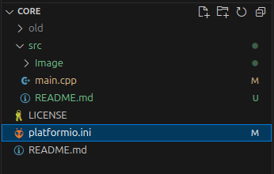
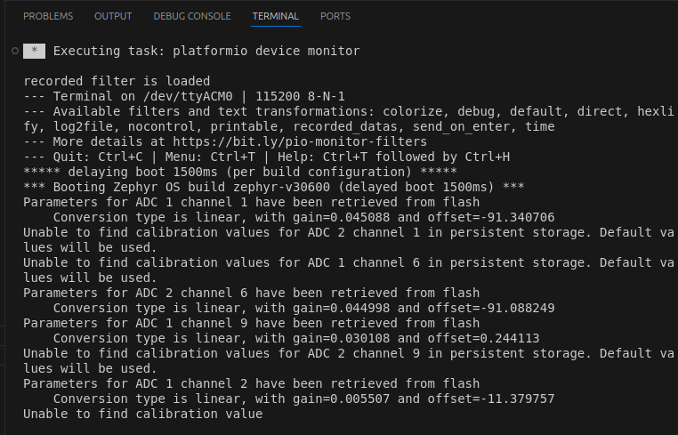

# Buck current mode

## Overview

A buck converter is a type of DC-DC converter used to efficiently regulate voltage levels. It works by converting a higher input voltage to a lower output voltage.

Peak current control mode is a technique used in DC-DC converters to regulate the output voltage. In this mode, the converter controls the output voltage by monitoring the peak current flowing through the inductor. During each switching period when the peak current reaches a set limit, the converter mosfet switches off. This mode helps maintain stable output voltage by adjusting the duty cycle of the switching signal based on the peak current level, ensuring efficient and reliable power conversion in real-time.

!!! warning The Buck stops here 
    Currently current mode is only supported for **buck configuration**.

!!! attention Are you ready to start ?
    Before you can run this example:
    - you **must** have successfully gone through our [getting started](https://docs.owntech.org/core/docs/environment_setup/).
    - ideally, you should have successfully gone through our [Voltage Mode Example](https://docs.owntech.org/examples/TWIST/DC_DC/buck_voltage_mode/)  


### Control diagram

The general implementation of the current mode follow this model.


_Source : STM32 AN5497_

!!! note Source material
    We recommend you check [stm32 application note](https://www.st.com/resource/en/application_note/an5497-buck-current-mode-with-the-bg474edpow1-discovery-kit-stmicroelectronics.pdf) for more informations about current mode.


### Requirement and schematic


!!! warning Hardwares pre-requisites
    You will need:
    - 1 twist
    - A DC power supply
    - A resistor (or a DC electronic load)

## Software setup

Locate your `platformio.ini file` in your working folder.




We will import `control_library` in `platformio.ini` by decommenting the line :

```ini
lib_deps=
    #control_lib = https://github.com/owntech-foundation/control_library.git
```
It should look like this: 

```ini
lib_deps=
    control_lib = https://github.com/owntech-foundation/control_library.git
```

We can use this library to initialize a PID control with the function :

```cpp
pid.init(pid_params);
```

the initial parameters are defined using the following lines :

```cpp
static Pid pid; // define a pid controller.

static float32_t Ts = control_task_period * 1.e-6F;
static float32_t kp = 0.000215;
static float32_t Ti = 7.5175e-5;
static float32_t Td = 0.0;
static float32_t N = 0.0;
static float32_t upper_bound = 1.0F;
static float32_t lower_bound = 0.0F;
static PidParams pid_params(Ts, kp, Ti, Td, N, lower_bound, upper_bound);
```

## Code overview
We initialize the leg control in buck current mode with the lines below and specify which mode we will operate under: 

```cpp
/* Initialize buck with current mode*/
shield.power.initBuck(ALL,CURRENT_MODE);
```

### Important functions

For current mode, there are two specific functions to control the current of both legs.

```cpp
shield.power.setSlopeCompensation(ALL,PeakRef, PeakRef - 0.5);
```

It sets in **volt** the higher and lower point of the sawtooth used for the slope compensation.

## Expected result

This code will control the output voltage to have 15V, you can control the output voltage with platformio serial monitor. The image below shows your a snippet of the window and the button to press.


When opening it for the first time, the serial monitor will give you an initialization message regarding the parameteres of the ADCs as shown below.  



!!! tip Commands keys
    - press `u` to increase the voltage
    - press `d` to decrease the voltage
    - press `h` to show the help menu

Here's sequence where: 
- the help menu is activated with `h`, 
- the power mode is then activated with `p` 
- the voltage reference is raised from `15 V` to `16 V`
- and finally the Twist converter is put in idle with the `i`. 


!!! note The data that you see
    When you send `p` the Twist board will send you back a stream of data on the following format: 
    
    ```c 
    Vref:V1:V2:IpeakRef
    ```
    Where: 
    - `Vref` is the reference voltage given to the Twist board for both legs on the `LOW` side
    - `V1` is the voltage in `LEG1` of the `LOW` side
    - `V2` is the voltage in `LEG2` of the `LOW` side
    - `IpeakRef` is the current reference calculated and given to both `LEG1` and `LEG2` of the `LOW` side

    For instance when you reveive this: 

    ```c 
    16.000:16.194:16.233:1.500:
    ```

    It means that `Vref = 16 V`, `V1 = 16.194 V`, `V2 = 16.233 V` and `IpeakRef = 1.5 A`. 


